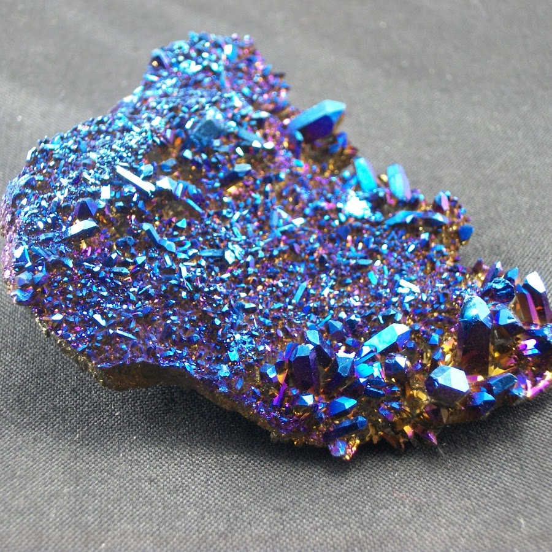

# Cobalt

An opinionated 2D renderer based on WebGpu, designed for sprite and tile games that minimizes CPU usage and maximizes frame rate.





## Required Goals

* pure WebGpu: no fallbacks to WebGl or canvas
* minimal abstractions: provide very light abstractions over what webgpu provides
* data oriented: ECS for all of it's performance and maintainability gains over scene graph and OOP nonsense
* gl-matrix compatible: use primitives compatible with how webgpu and webgl store rendering data (float32 arrays)
* GC friendly: does not thrash the garbage collector. uses API design that won't allocate memory all over the place
* back-to-front z-indexing


## Nice-to-have goals

Dunno if these will make the cut but things to strongly consider

* primitive drawing (lines, rectangles, ellipses, paths, etc.)
* intuitive render graph for highly configurable shaders


## Architecture

Cobalt can render 2 types of graphics; `sprites` and `tiles`.  It has totally different implementations for each.
These graphics are encapsulated into render passes, which corresponds to how WebGpu represents these internally.

A renderpass can only be of type `sprite` or `tile`. A renderpass also contains an ordered list of draw calls, one 
for each layer represented in this renderpass.

Here's an example of how the data for some specific layers might look:

```
        game layers                       what cobalt produces to render these
      ______________             _________________________________________________________  

     [ background   ]     ->    {
                                    renderpasses: [
                                         { type: tile,    drawCalls: [ background ]       }
                                         { type: sprite,  drawCalls: [ treasure ]         }
                                         { type: tile,    drawCalls: [ water ]            }
                                         { type: sprite,  drawCalls: [ hero, foreground ] }
                                    ]
                                }
     [ treasure     ]

     [ water        ]
 
     [ hero         ]

     [ foreground   ]

```

When Cobalt is initialized it will parse the provided layer descriptors, the tile and sprite sets passed in, and build the 
previously shown render passes that are used in the draw loop.


### Sprites
are typically dynamic; they can move, they are animated, they can be colored, rotated etc.

These use a `SpriteRenderPass` data structure which allows for dynamically adding/removing/updating sprites at run time.

Internally, `SpriteRenderPass` objects are rendered as instanced triangles. Adding and removing sprites pre-sorts all triangles based
on they layer they're on + the type of sprite they are. This lines up the data nicely for WebGpu such that they don't require any work in the 
render loop.

Each type of sprite is rendered as 2 triangles, with a number instances for each sprite. This instance data is transfered to the GPU,
which is then calculated in the shaders (position, rotation, scale, tinting, opacity, etc.)

All of the matrix math for these sprites is done in a vertex shader, so they are fairly efficient to move, color and rotate, but it's not free.
There is still some CPU required as the number of sprites increases.


### Tiles
typically belong to 2D levels. They are totally static, and there are usually many of them in a grid, in several layers.

These use a `TileRenderPass` data structure which provides 100% GPU hardware based tile rendering, making them _almost_ free CPU-wise.

Internally, `TileRenderPass` objects store 1 or more layers, which hold a reference to a sprite texture, and a layer texture.
When a tile layer is drawn, it loads the 2 textures into the gpu. One of these textures is a lookup table, where each pixel corresponds to a type of sprite. Because this processing can happen completely in the fragment shader, there's no need to do expensive loops over slow arrays in js land, which is the typical approach for current state-of-the-art web renderers.

(https://blog.tojicode.com/2012/07/sprite-tile-maps-on-gpu.html)[This is based largely off of Brandon's fantastic webgl hardware tile shader blog post that he wrote over a decade ago now.] Check this out! The blog post is to the point and the code is damn tight.


## API

It's maybe worth stating that the design of this API doesn't look conventional for javascript libraries, but it was chosen purposefully to
avoid creating a lot of extra objects.  Declaring arrays and other object types in high fps loops can cause lots more memory allocation

and that invokes the wrath of the garbage collector.


TODO: design the actual public API :)

### init

```javascript
```

### loadTileLayers

```javascript
```

### addSprite

```javascript
```

### removeSprite

```javascript
```

### updateSprite

```javascript
```

### draw

```javascript
```


## Examples 


