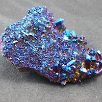

# Cobalt



An opinionated 2D renderer based on WebGpu, designed for sprite and tile games that minimizes CPU usage and maximizes frame rate.


## Goals

* pure WebGpu: no fallbacks to WebGl or canvas
* minimal abstractions: provide very light abstractions over what webgpu provides
* data oriented: no OOP or scene graphs
* gl-matrix compatible: use primitives compatible with how webgpu and webgl store rendering data (float32 arrays)
* GC friendly: does not thrash the garbage collector. uses API design that won't allocate memory all over the place
* back-to-front z-indexing


## API

```js
import * as Cobalt from 'cobalt'


// general calls
const c = Cobalt.create(canvas, viewportWidth, viewportHeight)
Cobalt.configureLayers(c, layers)
Cobalt.draw(c)
Cobalt.reset(c)
Cobalt.removeSprites(c)


// camera/viewport related calls
Cobalt.setViewportDimensions(c, width, height)
Cobalt.setViewportPosition(c, pos)


// sprite calls
Cobalt.configureSpriteRenderer(c, spritesheetJson, spriteTextureUrl, emissiveSpriteTextureUrl)
Cobalt.configureOverlayRenderer(c, spritesheetJson, spriteTextureUrl)

const spriteId = Cobalt.addSprite(c, name, position, width, height, scale, tint, opacity, rotation, zIndex)
Cobalt.removeSprite(c, spriteId)
Cobalt.setSpriteName(c, spriteId, name, scale)
Cobalt.setSpritePosition(c, spriteId, position)
Cobalt.setSpriteTint(c, spriteId, tint)
Cobalt.setSpriteOpacity(c, spriteId, opacity)
Cobalt.setSpriteRotation(c, spriteId, rotation)


// tile calls
Cobalt.configureTileRenderer(c, atlasTextureUrl, tileSize=16, tileScale=1.0)
Cobalt.addTileLayer(c, scrollScale, tileMapTextureUrl, zIndex)
Cobalt.removeTileLayer(c, tileLayerId)
```
