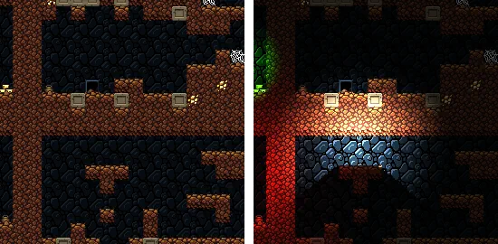
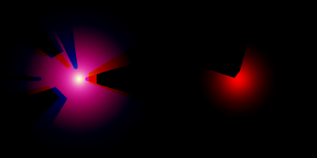
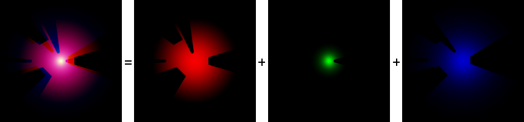
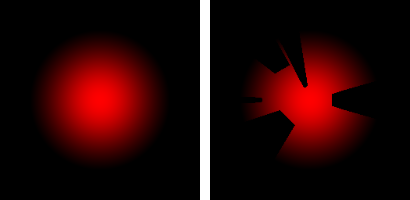
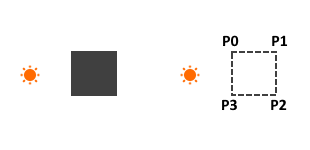
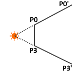

## Lighting system
Cobalt uses a deferred lighting system, where the `Light` node receives as input the albedo texture and combines it with the computed illumination to build the output.

 _On the left, the input albedo texture. On the right the output composition result._

### Algorithm

The lights are computed in 2 renderpasses:
- first renderpass: for each light we compute their illumination and shadows. We store the results in a texture called the "lights texture", where each lights has their data stored independently. This pass is handled by the `LightsTexture` class.
- second renderpass: composition time. For each pixel, we determine which lights might affect it. Then we check these lights contribution by sampling the lights texture. We sum all contributions to get a total illumination for the pixel. We then multiply it by the color sampled from the albedo texture. This pass is handled by the `LightsRenderer` class.

We must perform the composition for every frame. However, the lights texture only needs to be recomputed when either the lights (movement, intensity, color etc.) or the shadow-casting objects changed.

#### Lighting equation
We use a lighting equation that is not physically accurate, but is flexible and gives good enough results. You can find it in the `LightsTextureInitializer` shader

#### Lights texture
The lights texture stores the computed illumination of each light. This illumination is a combination of the light intensity and the cast shadows. It is a one-dimensional value because the light color is applied at composition-time. Here is an example of what the lights texture looks like:

For technical reasons, we store all lights into a  single texture:
- each light is assigned a square area in the texture. The center of the area is the center of the light. In the example above, there are two areas. All lights have the same resolution, which means that there is a maximum light radius. If a light's radius is above this limit, it means that light is too big to be stored in its area, which will result in visual artifacts. If we stored lights with floating resolution (= the biggest lights are lower resolution than the small ones), we could remove this max radius limit.
- each light is stored into a single texture channel. This is possible because the light intensity is a simple float. This allows us to store 4 lights in a single texel, one per channel (Red, Green, Blue, Alpha). The above texture has two areas and four channels, which means it can store up to 8 lights.

_Illustration of a single area storing the data of 3 lights_

The lights texture stores normalized lights intensity (between 0 and 1). At composition-time we multiply the intensity sampled from texture by the maximum intensity of the light, which allows us to have lights brighter than 1.

Here is how the lights texture is computed by the `LightsTexture` class (illustrated with a single light for clarity):
- first we compute the base lights intensity (class `LightsTextureInitializer`)
- then we add the cast shadows as a mask (class `LightsTextureMask`)

_One the left, the base light intensity. On the right, the base light intensity with the cast shadows_

##### Cast shadows computing
All lights in Cobalt are point-lights.

The shadow-casting objects are decomposed as a series of segments.

_On the left, the base obstacle. On the right, its decomposition into segments P0-P1, P1-P2, P2-P3, P3-P0._

Then, the key is to observe that the cast shadow is a quad, where two points are the obstacle segments, and two points are their projection relatively to the point light.

_P0' and P3' are the projection of P0 and P3 respectively_

This projection is performed in the vertex shader. When the CPU declares an obstacle composed of `vec2` vertices P0 and P1, in the GPU buffer it creates 4 `vec3` vertices where the `z` components indicates whether the vertice will be projected:
- [P0x, P0y, 0] and [P1x, P1y, 0] will remain at the position of P0 and P1
- [P0x, P0, 1] and [P1x, P1y, 1] will be their projection

And then we draw the quad P0, P0', P1', P1 which covers the cast shadow.